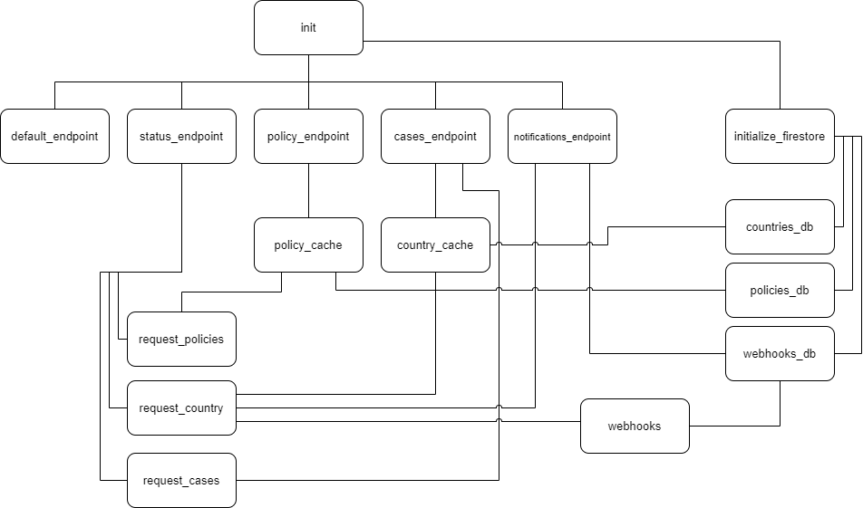
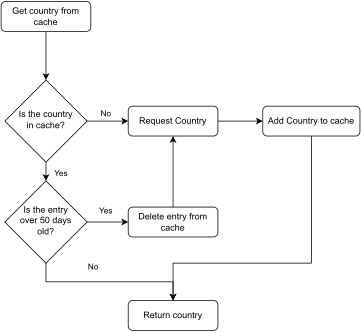

# Assignment 2: REST-Covid-Info

Deployed service: http://10.212.137.224. (Only available on the NTNU internal network)

This project is a submission to the second assignment in PROG-2005: Cloud Technologies. 
It is a REST web application in Golang that provides the client with the ability to retrieve information 
about Corona cases occurring in different countries, as well as the number and stringency of current policies in place.

Webhooks are also supported, for receiving updates based on how frequent a specific country is invoked.

The API depends on the following external services:

- The [Oxford COVID-19 Government Response Tracker](https://covidtracker.bsg.ox.ac.uk/) provides information about 
which policies are in place in different countries, and the stringency of those policies.
- The [Covid19 GraphQl API](https://covid19-graphql.now.sh/) by [rlindskog](https://github.com/rlindskog) provides 
information about the number of cases in different countries. ([Documentation and more info](https://github.com/rlindskog/covid19-graphql))
- The [Rest Countries API](https://restcountries.com/) by [Alejandro Matos](https://gitlab.com/amatos) provides 
conversion between ISO 3166-1 alpha-3 country codes and country names. ([Documentation and more info](https://gitlab.com/amatos/rest-countries))

Thank you to all developers who develop open source and free to use APIs like these.

## Table of Contents

[TOC]

## Endpoints

The service is provided by the following endpoints:
```text
/corona/v1/cases/
/corona/v1/policy/
/corona/v1/status/
/corona/v1/notifications/
```

### Covid-19 Cases per Country

This endpoint returns the latest number of cases and deaths for a given country, alongside growth rate of cases.

#### Request

```
Method: GET
Path: /corona/v1/cases/{:country}
```
```{:country}``` is the country for which the information is requested. 
This can be the name of a country, or a country code.

Example request: ```/corona/v1/cases/Norway```

#### Response

Content type: ```application/json```  
Status codes:
- 200: Success
- 400: Bad request; something was wrong with the request, like missing the country name, or to many parameters.
- 404: Not found; no data was found for the requested country.
- 405: Method not allowed; only GET is allowed.
- 500: Internal server error; something went wrong with the server.

Body:
```text
{
    "country": <country_name>,        (string)
    "date": <scope>,                 (string)
    "confirmed": <confirmed_cases>,  (int)
    "recovered": <recovered_cases>,  (int)
    "deaths": <deaths>,              (int)
    "growth_rate": <growth_rate>     (float)
}
```

#### Example requests and responses

Request: ```/corona/v1/cases/Norway```

Response:
```json
{
    "country": "Norway",
    "date": "2022-04-03",
    "confirmed": 1408708,
    "recovered": 0,
    "deaths": 2518,
    "growth_rate": 0.0003202540445387454
}
```

Request: ```/corona/v1/cases/SWE```
```json
{
    "country": "Sweden",
    "date": "2022-04-03",
    "confirmed": 2487852,
    "recovered": 0,
    "deaths": 18365,
    "growth_rate": 0
}
```

### Covid Policy Stringency per Country

#### Request

This endpoint provides an overview of the current stringency level of policies regarding Covid-19 for a given country, 
in addition to the number of currently active policies.

```
Method: GET
Path: /corona/v1/policy/{:country_code}{?scope=YYYY-MM-DD}
```

```{:country_code}``` is the ISO 3166-1 alpha-3 code of the country for which the information is requested.  
```{?scope=YYYY-MM-DD}``` is optional, and if present, it is the date for which policy stringency information is 
requested. If no scope is given, the latest policy stringency information is returned. If there is no avalable data
for the last 7 days, an error is returned.

Example request: ```/corona/v1/policy/NOR?scope=2022-04-03```

#### Response

Content type: ```application/json```  
Status codes:
- 200: Success
- 400: Bad request; something was wrong with the request, like missing the country name, wrong date format, or to many parameters.
- 404: Not found; no policy stringency information available for the given country and scope.
- 405: Method not allowed; only GET is allowed.
- 500: Internal server error; something went wrong with the server.

Body:
```text
{
    "country": <country_name>,        (string)
    "date": <scope>,                  (string)
    "stringency": <stringency_level>, (float)
    "policies": <policies>            (int)
}
```

#### Example requests and responses

Request: ```/corona/v1/policy/NOR?scope=2021-04-03```
```json
{
    "country_code": "NOR",
    "scope": "2021-04-03",
    "stringency": 71.3,
    "policies": 23
}
```

Request: ```/corona/v1/policy/SWE```
```json
{
    "country_code": "SWE",
    "scope": "2022-04-02",
    "stringency": 19.44,
    "policies": 0
}
```

### Status Interface

The status interface indicates the availability of all individual services this service depends on.

#### Request

```
Method: GET
Path: /corona/v1/status/
```

#### Response

Content type: ```application/json```
Status codes:
- 200: Success
- 405: Method not allowed; only GET is allowed.
- 500: Internal server error; something went wrong with the server.

Body:
```text
{
   "cases_api": "<http status code for *Covid 19 Cases API*>",              (int)
   "policy_api": "<http status code for *Corona Policy Stringency API*>",   (int)
   "country_api": "<http status code for *Country API*>"                    (int)
   "webhooks": <number of registered webhooks>,                             (int)
   "version": <version>,                                                    (string)
   "uptime": <time from the last service restart>                           (string)
}
```

#### Example request and response

Request: ```/corona/v1/status/```

Response:
```json
{
    "cases_api": 200,
    "policy_api": 200,
    "country_api": 200,
    "webhooks": 1,
    "version": "v1",
    "uptime": "24s"
}
```

### Notifications endpoint

Users can register webhooks that are triggered by the service based on how frequent a given country is being invoked, 
where the minimum frequency is specified by the user.

#### Registration of Webhook

##### Request

```
Method: POST
Path: /corona/v1/notifications/
```

Content type: ```application/json```

Body:
```text
{
    "url": {url},                   (string)
    "country": {country},           (string)
    "calls": {minimum frequency}    (int)
}
```

```{url}``` is the URL to be triggered upon event (the service that should be invoked).  
```{country}``` is the country for which the trigger applies. Can be the country code (ISO 3166-1 alpha-3) or the country name.  
```{minimum frequency}``` is the minimum number of repeated invocations before notification should occur (i.e., "greater equals").


##### Response

Content type: ```application/json```
Status codes:
- 201: Success; Webhook created.
- 400: Bad request; something was wrong with the request, like missing the country name, wrong date format, or to many parameters.
- 405: Method not allowed.
- 500: Internal server error; something went wrong with the server.

Body:
```
{
    "webhook_id": <webhook_id>, (string)
}
```

##### Example request and response

Request: ```/corona/v1/notifications/```  
Body: 
```json
{
    "url": "https://example.com/notification", 
    "country": "NOR", 
    "calls": 3
}
```

Response:
```json
{
    "webhook_id": "d99f52fa1eac2495f8b980e33a848e04823af7926b9363c036ae096be3dc37a5"
}
```

#### Deletion of Webhook

##### Request

```
Method: DELETE
Path: /corona/v1/notifications/{webhook_id}
```

```{webhook_id}``` is the ID of the webhook to be deleted. This is returned during the webhook registration.

##### Response

Content type: ```text/plain```  
Status codes:
- 200: Success; Webhook deleted.
- 400: Bad request; to long path.
- 404: Not found; no webhook with the given ID was found.
- 405: Method not allowed.
- 500: Internal server error; something went wrong with the server.

Body:
```text/plain
confirm/error message
```

##### Example request and response

Request: ```/corona/v1/notifications/d99f52fa1eac2495f8b980e33a848e04823af7926b9363c036ae096be3dc37a5```

Response:
```text/plain
webhook deleted
```

#### View registered webhook

##### Request

```
Method: GET
Path: /corona/v1/notifications/{webhook_id}
```

```{webhook_id}``` is the ID of the webhook to view. This is returned during the webhook registration.

##### Response

Content type: ```application/json```
Status codes:
- 200: Success; Webhook found.
- 400: Bad request; to long path.
- 404: Not found; no webhook with the given ID was found.
- 405: Method not allowed.
- 500: Internal server error; something went wrong with the server.

Body:
```text
{
    "webhook_id": <webhook_id>,     (string)
    "url": <url>,                   (string)
    "country": <country>,           (string)
    "calls": <minimum frequency>    (int)
}
```

##### Example request and response

Request: ```/corona/v1/notifications/d99f52fa1eac2495f8b980e33a848e04823af7926b9363c036ae096be3dc37a5```

Response:
```json
{
    "webhook_id": "d99f52fa1eac2495f8b980e33a848e04823af7926b9363c036ae096be3dc37a5",
    "url": "https://example.com/notification",
    "country": "Norway",
    "calls": 3
}
```

##### View all registered webhooks

##### Request

```
Method: GET
Path: /corona/v1/notifications/
```

##### Response

Content type: ```application/json```
Status codes:
- 200: Success; Webhooks retrieved.
- 400: Bad request; to long path.
- 405: Method not allowed.
- 500: Internal server error; something went wrong with the server.

Body:
```text
[
    {
        "webhook_id": <webhook_id>,     (string)
        "url": <url>,                   (string)
        "country": <country>,           (string)
        "calls": <minimum frequency>    (int)
    },
    ...
]
```

##### Example request and response

Request: ```/corona/v1/notifications/```

Response:
```json
[
    {
        "webhook_id": "2c5c00f9a7ec9f32b06a3d28b1866120d4af9fa04011206df1e0f1089f40d414",
        "url": "https://example2.com/notification",
        "country": "Sweden",
        "calls": 5
    },
    {
        "webhook_id": "d99f52fa1eac2495f8b980e33a848e04823af7926b9363c036ae096be3dc37a5",
        "url": "https://example.com/notification",
        "country": "Norway",
        "calls": 3
    }
]
```

### Triggered Webhook

The following describes the request that is sent when a webhook is triggered.

##### Request

```
Method: POST
Path: <url specified in the corresponding webhook registration>
```

- Content type: ```application/json```

Body:
```Text
{
    "webhook_id": <webhook id made during registration>,                            (string)
    "country": <country specified in the corresponding webhook registration>,       (string)
    "calls": <number of calls specified in the corresponding webhook registration>, (int)
}

```

Example body:
```json
{
    "webhook_id": "d99f52fa1eac2495f8b980e33a848e04823af7926b9363c036ae096be3dc37a5",
    "country": "Norway",
    "calls": 3
}
```

## Deployment

The is deployed on: http://10.212.137.224/corona/v1/ . This can be reached only on
NTNU's internal network. The application is running on a Docker container, on a VM hosted on SkyHigh.

If you want to run the application locally, you can either create a Docker container, or compile and run the source code.

### Compilation requirements

For the application to be able to compile, you need to add the following files to the project.

#### Google firestore service account key

Name: ```serviceAccountKey.json```  
Location: ```/assignment-2/serviceaccountkey.json```  

This can be acquired from the Google Firebase Console.

#### Hash secret

Name: ```secret.go```  
Location: ```/assignment-2/internal/utility/hash_util/secret.go```

Content:
```go
package hash_util

var hashSecret = []byte("YOUR_SECRET_HERE")

func getHashSecret() []byte {
	return hashSecret
}
```

### Deployment in Docker

Follow these steps to run the API on Docker:

1. Clone the repository.
2. Make sure to meet the compilation requirements.
3. Install the following packages on the machine:
    - docker.io
    - docker-compose
4. Open a terminal window, and navigate to the ```/assignment-2/``` directory.
5. Run the following command to create and run the Docker container:
    - docker-compose up -d

The docker container is now running on port 8080 on the local machine.


### Deployment by compiling and running the source code

Follow these steps to compile and run the source code:
1. Clone the repository.
2. Make sure to meet the compilation requirements.
3. Open a terminal window, and navigate to the ```/assignment-2/``` directory.
4. Run the following command to compile and run the source code:
    - ```go run cmd/main.go```

The application is now running on port 8080 on the local machine.

## Design choices

This API is made as close to the assignment specification as possible, with some extra features. (See [Extra features](#extra-features))

### Project structure and dependencies

The project is structured in the following way: (files not shown)

```text
├───cmd                                                                    
├───docs                                                                   
└───internal
    └───webserver
        ├───api_requests
        │   ├───cases_api
        │   ├───countries_api
        │   └───policy_api
        ├───cache
        │   ├───country_cache
        │   └───policy_cache
        ├───constants
        ├───db
        │   ├───countries_db
        │   ├───policies_db
        │   └───webhooks_db
        ├───handlers
        │   ├───cases_handler
        │   ├───default_handler
        │   ├───notifications_handler
        │   ├───policy_handler
        │   └───status_handler
        ├───mock_apis
        ├───structs
        ├───utility
        │   ├───encode_struct
        │   ├───hash_util
        │   ├───logging
        │   ├───request
        │   └───uptime
        └───webhooks
```

The project structure was created with the goal of responsibility driven design, loose coupling, high cohesion, 
ease of maintenance, and to minimize code duplication overall.

The different parts of the program is divided into packages after what responsibility they have, like the handlers
package, which handles the requests from the clients. The handlers package contains the different handlers for the
different endpoints.

This way of abstracting the program makes it somewhat more difficult to keep track of the dependencies between
the different packages. To gain overview of the dependencies, the following diagram is made:



The utility package is not added to this diagram, since they have dependencies to very many other packages, and therefore
would make the diagram difficult to read.

### Limiting API-requests

When designing the functions in the program, there was a goal to reduce the number of
requests sent to the APIs to a reasonable limit.

#### Cache

One way this was achieved was by implementing a cache.
The program caches the results of some types of API-requests, and when the same request is made again, the result is 
returned from the cache instead of making a new request.
The program caches the results of the countries API, and the policies API.

The cache is stored in a database, so the cache stays persistent between restarts of the program.

This flowchart shows an example of how to cache works:



#### Query validation

Another way to reduce the number of API-requests was to validate the queries before sending them to the APIs.
This reduces the amount of requests sent to the APIs, and the requests that are sent has a bigger chance of giving
a valid response.

### Testing

The application is tested, using automated testing facilities provided by Golang, to ensure that the program is
working as intended. Unit-tests written in the table-driven testing style was used. Each test 
resides inside the same package as the units that are being tested, that ensures that also private functions can be tested.

The table-driven testing style is used, since it creates an easy to understand and maintainable test suite, with easy 
opportunities to add new tests. 

The different APIs used in the application were mocked during testing, to ensure predictable responses, 
and to ensure that the program is not sending requests to the real APIs, which helps the rate-limiting problem.

## Extra features

### Caching country data

Beyond the caching that was specified in the assignment, the application also caches which alpha-3 codes the
different countries have. This achieves faster response times, and fewer requests to the country API.

### Using Go routines

When webhooks was implemented, the response time of the application was increased, since the program had to check the
webhooks, count up the number of invocations, and then trigger the correct webhooks.
By using a go routine for starting this process, and another one for triggering the webhooks, the response time
was significantly reduced.

### Logging

In order to have an overview of which requests are being made, the program logs where each request comes from, what
the requested URL is, and which method was used. This is printed out to the console while the program is running.

Example: (with made up ip-addresses)
```text
2022/04/07 13:03:09 10.24.100.231:1124 - - GET /corona/v1/policy/UGA?scope=2021-03-02 HTTP/1.1
2022/04/07 13:03:17 10.27.89.203:5313 - - GET /corona/v1/policy/UGA?scope=2021-03-02 HTTP/1.1
2022/04/07 13:03:24 10.24.100.231:1124 - - GET /corona/v1/policy/UGA?scope=2021-03-02 HTTP/1.1
2022/04/07 13:43:12 10.27.89.203:5313 - - GET /corona/v1/cases/RWA HTTP/1.1
2022/04/07 13:43:53 89.102.3.112:2312 - - GET /corona/v1/cases/RWA HTTP/1.1
2022/04/07 14:09:59 89.102.3.112:2312 - - GET /corona/v1/cases/NOR HTTP/1.1
2022/04/07 14:10:03 10.27.89.203:5313 - - GET /corona/v1/cases/status HTTP/1.1
2022/04/07 14:10:24 10.24.100.231:1124 - - GET /corona/v1/cases/RWA HTTP/1.1
2022/04/07 14:10:29 89.102.3.112:2312 - - GET /corona/v1/cases/FRA HTTP/1.1
2022/04/07 14:10:32 10.24.100.231:1124 - - GET /corona/v1/status/ HTTP/1.1
2022/04/07 14:10:48 10.27.89.203:5313 - - GET /corona/v1/policy/RUS HTTP/1.1
2022/04/07 14:11:04 89.102.3.112:2312 - - GET /corona/v1/policy/RUS?scope=2021-10-05 HTTP/1.1
2022/04/07 14:11:14 10.27.89.203:5313 - - GET /corona/v1/policy/RUS?scope=2021-09-22 HTTP/1.1
2022/04/07 14:11:29 10.24.100.231:1124 - - GET /corona/v1/policy/DNK?scope=2021-09-22 HTTP/1.1
```

### Docker Compose

For ease of deployment, a [docker-compose file](docker-compose.yml) is written, which contains the necessary information to run the
application in a docker container. 

### Adv. Task: Cases Endpoint allows alpha-3 codes

The Policy endpoint allows for the alpha-3 codes of the countries to be specified. This is done by converting the alpha-3
code to the country name using the REST countries API, and then using the country name to get the policy.

### Adv. Task: Cache entries expiration

When caching data from the APIs, there is a possibility that some entries will become outdated, when the APIs
update their data. Therefore, each cache entry has a timestamp of when the entry was created. Each time the
entry is accessed, the timestamp is checked against a set expire limit. If the entry is older than the expiry limit,
the entry is removed from the cache, and a new entry is requested from the APIs.

### Adv. Task: unified handling of country name in Webhooks

When a webhook is registered, counted, or triggered, the program uses a unified handling of country names and alpha-3 codes.

## Edge cases

### Resolved

#### Policy API unavailable for current date

The policy API does not have data for the current date for any country. Sometimes even yesterday, or even a day before, 
has any data. Therefore, instead of defaulting to requesting the policy for the current date when no scope is given, 
the program will check the last 7 days for any data, and pick the latest one. This ensures that the default 
request without scope always responds the latest data.

#### When no policies are active

If the policy API is queried with a country and scope where there are no policies active, the API responds with the 
following response:
```json
{
   "policyActions": [
      {
         "policy_type_code": "NONE",
         "policy_type_display": "No data.  Data may be inferred for last 7 days.",
         "flag_value_display_field": "",
         "policy_value_display_field": "No data.  Data may be inferred for last 7 days.",
         "policyvalue": 0,
         "flagged": null,
         "notes": null
      }
   ]
}
```

Therefore, the program cannot simply count the length of the policyActions array, since the one that is in there,
tells us that there are no policies active. Instead, the program will check if the policy_type_code is equal to "NONE",
and if it is, set the active policies to 0.

### Not resolved

#### Difference in country name standards

For conversion between country codes and country names, the API uses the REST countries API. The country name that
is returned by this API may not always be the one that the Cases API uses. Therefore, in some cases, the country
will not be found in the Cases API, even though a valid country code was given. Some examples are the following:
- Country API: "United States", Cases API: "US"
- Country API: "South Korea", Cases API: "Korea, South"
- Country API: "DR Congo", Cases API: "Congo, (Kinshasa)"
- Country API: "Republic of the Congo", Cases API: "Congo, (Brazzaville)"

#### REST Countries API; Invalid Certificate

In the time of writing (2022-04-07), the REST Countries API seems to have some issues with their TLS certificate, 
but only of some of their instances. Therefore, there may be some occasions where the program will fail to connect, 
and therefore give and error message. This usually fixes itself by just trying the request again.

## Further improvements

### Better test coverage

As of now, the test coverage lies around 80% of the lines in the tested packages. However, there are still some
packages that are not tested yet. The most important ones would be the db package, webhooks package, and the
cache package.

Although they are not unit tested, they are indirectly tested through other packages, mainly through the testing of
the endpoints. Therefore, the main functionality of all packages is tested in varying degrees.

### Secret handling

To be able to hash different IDs for the database, the program uses a secret hash key. This key is now stored in a
go file, with an accessor function that can be used to get the key. When the project is cloned, you would have to
rewrite this file (see [hash secret](#hash-secret)). This is done to ensure that the key is not stored in the repository.

### Error responding

When an error occurs in the API, it responds with the correct error message as plain text, which is readable for the user.
A better alternative could be to return the error message as JSON, to make it more readable for machines.

Example:
```json
{
   "error": "The API responded with an error."
}
```
